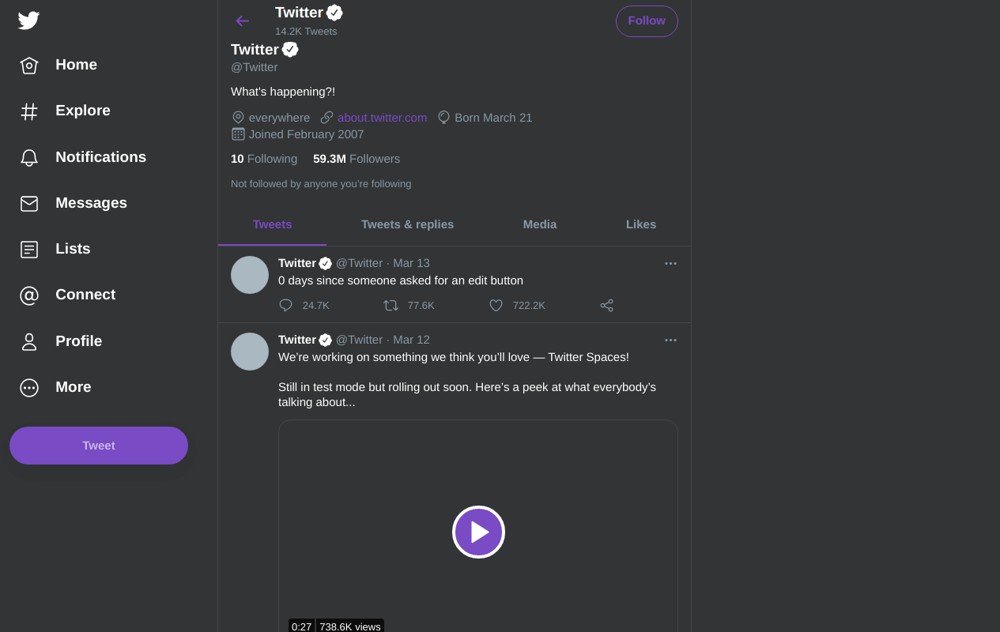
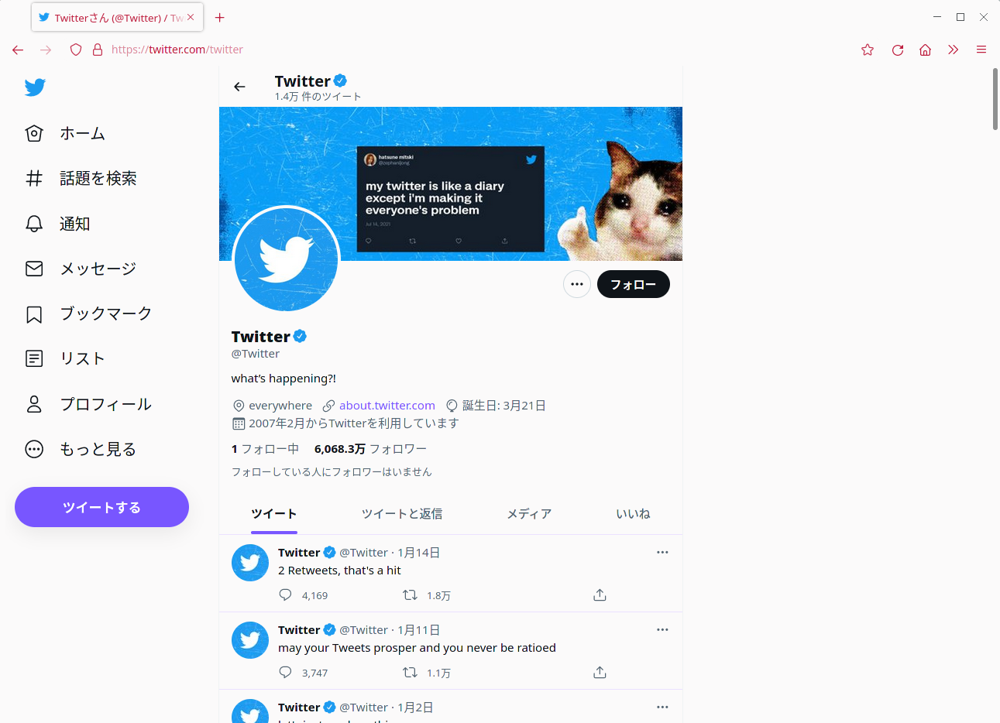

# Twitter Reading Dark

A twitter dark theme for better reading experience, intended to hide all twitter suggestions.

## Preview

## Installation

A userstyle extension is required, common ones include:

- Stylus for [Firefox](https://addons.mozilla.org/en-US/firefox/addon/styl-us/), [Chrome](https://chrome.google.com/webstore/detail/stylus/clngdbkpkpeebahjckkjfobafhncgmne) or [Opera](https://addons.opera.com/en-gb/extensions/details/stylus/).

- xStyle for [Firefox](https://addons.mozilla.org/firefox/addon/xstyle/) or [Chrome](https://chrome.google.com/webstore/detail/xstyle/hncgkmhphmncjohllpoleelnibpmccpj).

Then:

1. 📦 [Install the usercss](https://github.com/suienzan/Twitter-Reading-Dark/raw/main/twitter-reading-dark.user.css). It supports automatic updates.

2. Change twitter display setting: More - Display - Background to `Dim`. Or to `Default` if you use light theme.
